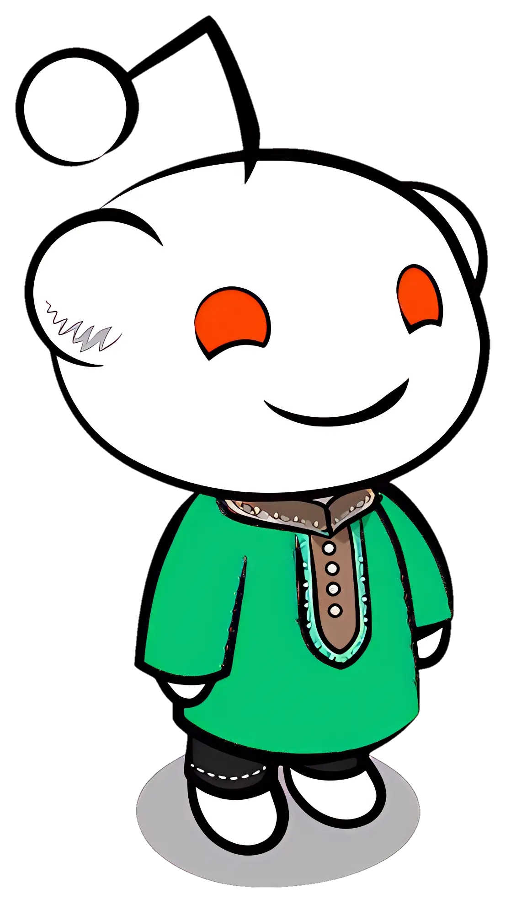

### Hi there 👋
  I'm tomoayan who loves to contribute on FOSS projects and passionate about technology, in this domain my highly interested topics are Ethical Hacking, Cyber Security and UI/UX. You can see me to contribute on these topics frequently, along with this I try to contribute as a translator to different projects.
On the other hand I really loved to do multimedia editing and sometimes i also do some content creating works.

<!-- github stats -->
<picture>
<source srcset="https://github-readme-stats.vercel.app/api?username=tomoayan&theme=gotham&bg_color=00000000&show_icons=true&include_all_commits&count_private=true&hide=contribs&hide_border=true&card_width=300&custom_title=My%20Stats" media="(prefers-color-scheme: dark)" />
<source srcset="https://github-readme-stats.vercel.app/api?username=tomoayan&bg_color=00000000&show_icons=true&include_all_commits&count_private=true&hide=contribs&hide_border=true&card_width=300&custom_title=My%20Stats" media="(prefers-color-scheme: light), (prefers-color-scheme: no-preference)" />

</picture>&nbsp;
<!-- most used langueges -->
<picture>
<source srcset="https://github-readme-stats.vercel.app/api/top-langs/?username=tomoayan&layout=compact&theme=gotham&bg_color=00000000&hide_border=true" media="(prefers-color-scheme: dark)" />
<source srcset="https://github-readme-stats.vercel.app/api/top-langs/?username=tomoayan&layout=compact&bg_color=00000000&hide_border=true" media="(prefers-color-scheme: light), (prefers-color-scheme: no-preference)" />

</picture>
